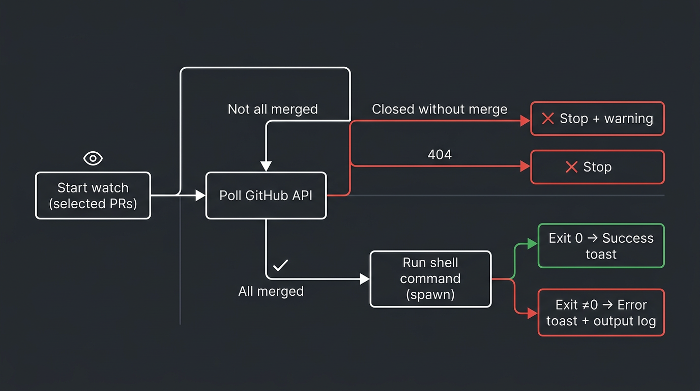
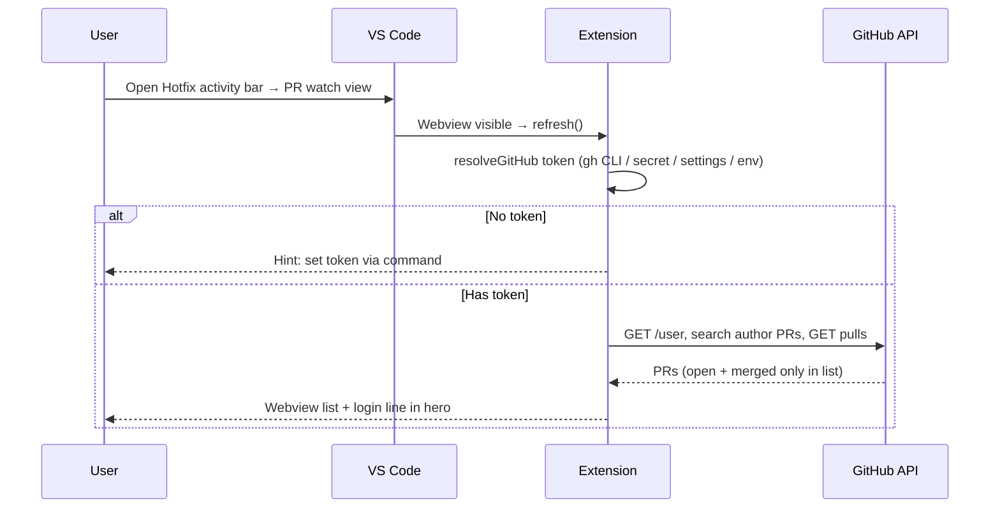
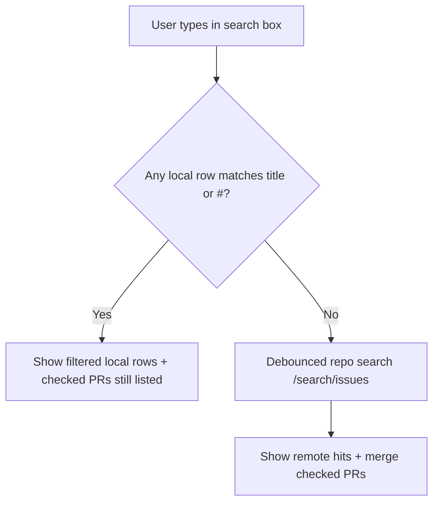
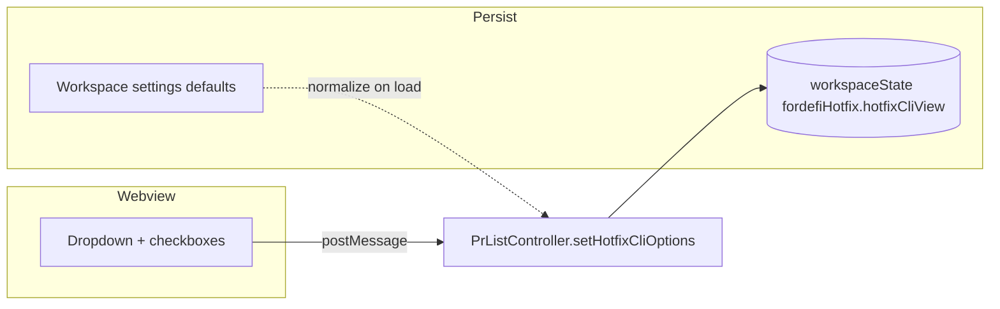

# Fordefi Hotfix Watcher — user flows

This document walks through the main end-to-end flows in the extension. It mixes **illustrative figures** (generated UI / flow overview) with **Mermaid diagrams** you can render in GitHub, VS Code Markdown preview, or any Mermaid-capable viewer.

---

## Figure A — Webview layout (concept)

High-level idea of the **Hotfix PRs** side panel: hero, optional **Live watch** banner, search, hotfix CLI row, filter/sort row, then the PR list.


---

## Figure B — Watch merged PRs → run CLI → outcome (concept)

From **Start watch** through polling, merge detection, running the configured shell command, and **success / failure notifications** plus the **Fordefi Hotfix CLI** output channel.



---

## Flow 1 — Open panel, authenticate, load PRs



**Settings involved:** `fordefiHotfix.owner`, `fordefiHotfix.repo`, optional `repoRoot`, `recentPrCount`.

---

## Flow 2 — Search (local then GitHub)



Remote search only returns **open or merged** rows (same rules as the main list).

---

## Flow 3 — Hotfix CLI row (env, draft, fast track)



The **command** built after merge uses `buildHotfixCliSuffix` from these options plus `fordefiHotfix.commandTemplate` and `{prNumbers}` / `{hotfixSuffix}`.

---

## Flow 4 — Status filter and sort

```mermaid
flowchart TD
  R[Display rows from search merge] --> F[applyPrViewFilterSort]
  F --> G[Status: All | Open | Merged]
  F --> H[Sort: Open first | Newest by created_at]
  G --> I[List in webview]
  H --> I
  J[Checked PRs] -.->|always kept visible| F
```

Choices persist in **`fordefiHotfix.prListView`** (workspace state).

---

## Flow 5 — Watch until merge, then run CLI (detailed)

```mermaid
sequenceDiagram
  participant U as User
  participant W as Webview
  participant P as PrListController / WatchSession
  participant GH as GitHub
  participant T as Integrated terminal / spawn
  participant O as Output channel

  U->>W: Check PRs → Start watching
  W->>P: startWatch()
  P->>P: watchTarget, watchEntries, interval poll
  loop Each poll interval
    P->>GH: getPullRequest for each target
    GH-->>P: state + merged_at
    P->>P: phaseFromSettledPulls
    alt Still open
      P-->>W: watchPanel + Waiting on #…
    else Closed without merge
      P-->>U: Warning, stop watch
    else 404
      P-->>U: Error, stop watch
    else Transient error
      P-->>U: Status updates; toast throttled
    else All merged_at set
      P->>P: ensureHotfixWorktree, buildHotfixCommand
      P->>T: run command (mode = integratedTerminal | background)
      T->>O: stream stdout/stderr
      alt Exit 0
        P-->>U: Information: success for #…
      else Non-zero or signal
        P-->>U: Error/warning + Open output
      end
    end
  end
```

**Run mode** (`fordefiHotfix.debugTerminal`) decides where the post-merge command executes:

- **`false`** (default, transparent mode): silent spawn; output goes to the *Fordefi Hotfix CLI* output channel; user sees only action prompts (YubiKey, conflict) and milestone notifications.
- **`true`** (debug terminal mode): a real integrated terminal so you can watch every line, interact with prompts, and answer YubiKey / `[y/n]` directly.

The deprecated `fordefiHotfix.hotfixRunMode` setting still works but `debugTerminal` takes precedence.

Full logs: **View → Output → "Fordefi Hotfix CLI"** (and **"Fordefi Hotfix Deploy"** when the deploy phase runs).

---

## Flow 6 — Persisted vs in-memory UI state

| Data | Persists? | Where |
|------|------------|--------|
| Hotfix CLI row (env, draft, critical fast track) | Yes | `workspaceState` `fordefiHotfix.hotfixCliView` |
| PR filter + sort | Yes | `workspaceState` `fordefiHotfix.prListView` |
| Checkbox selection | Yes | `workspaceState` `fordefiHotfix.selectedPrs` |
| Search query | No | In memory |
| GitHub PAT override | Yes | Secret Storage |
| Owner, repo, templates, etc. | Yes | VS Code settings |

---

## Flow 7 — Commands from the palette / title bar

Typical commands (see `package.json`):

- **Hotfix: Refresh** — reload author PR list, reset search.
- **Hotfix: Start / Stop watch** — toggle polling.
- **Hotfix: Set / Clear stored GitHub token** — PAT vs `gh auth token`.
- **Hotfix: Sync repo from Git** — set `owner` / `repo` from `origin` when it is a `github.com` remote.

---

## Rendering Mermaid locally

- **VS Code:** Markdown Preview (built-in) often renders `mermaid` fenced blocks; if not, install a “Mermaid” preview extension.
- **GitHub:** Renders Mermaid in `.md` files in the repository view.

---

## Asset files

| File | Role |
|------|------|
| `docs/assets/flow-webview-layout.png` | Illustrative webview layout |
| `docs/assets/flow-watch-to-cli.png` | Illustrative watch → CLI → outcome |

Figures are **stylized** guides, not pixel-perfect screenshots of your theme.
